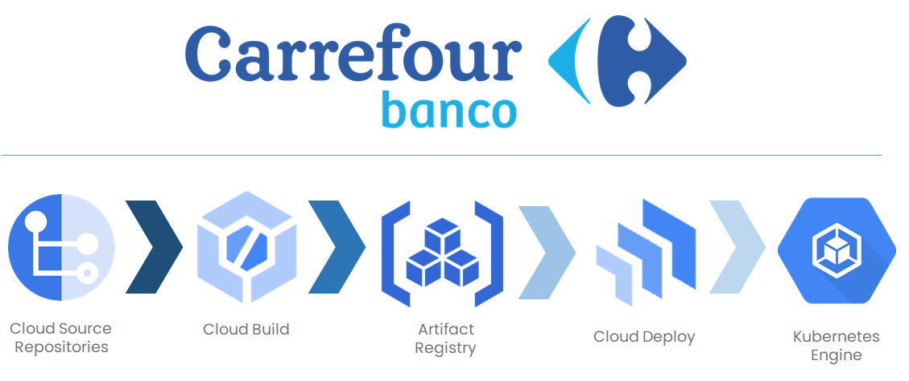

<h1>Repositório dos arquivos do projeto base para o projeto Tech Day do Bootcamp "Cloud DevOps Experience - Banco Carrefour"</h1>

<h2>Características da aplicação:</h2> 

•	Frontend (HTML/CSS/JS)<br>
•	Backend (PHP e MySQL)

<h3>O participante é livre para alterar as linguagens de programação e/ou realizar melhorias no projeto, desde que atenda às exigências de entrega.</h3>

O participante deverá criar um pipeline de deploy desta aplicação em forma de Containers em um cluster Kubernetes. O participante poderá utilizar um cluster
kubernetes em nuvem (Preferencialmente utilizando GCP).

<h2>Entrega do projeto</h2>

Com o problema apresentado, o participante poderá entrar o seu pipeline de CI/CD utilizando o Gitlab, Terraform ou outra solução desejada, como o exemplo abaixo:

https://gitlab.com/denilsonbonatti/app-cicd-dio/-/blob/main/.gitlab-ci.yml

O participante deverá apresentar um vídeo com o pit da sua solução com no máximo 5 minutos.

Link do formulário de entrega:

https://forms.office.com/r/S8MHD0HrUb

---



Detalhamento dos procedimentos necessários para a criação de um Pipeline de CI/CD de uma aplicação em PHP e MySQL utilizando o Google Cloud Platform.

Para este desafio foram utilizadas as referências:
	1. [Projeto k8s DIO](https://github.com/danietakeshi/k8s-projeto1-app-base)
	2. [CI/CD for GKE using Cloud Deploy](https://davelms.medium.com/automate-gke-deployments-using-cloud-build-and-cloud-deploy-2c15909ddf22)

## Ferramentas GCP utilizadas

1. [Cloud Source Repositories](https://source.cloud.google.com/)
2. [Artifact Registry](https://cloud.google.com/artifact-registry)
3. [Cloud Build](https://cloud.google.com/build)
4. [Cloud Deploy](https://cloud.google.com/deploy)
5. [Google Kubernetes Engine (GKE)](https://cloud.google.com/kubernetes-engine)


## Passo a Passo da Implementação

1. Construir uma aplicação em container com o Cloud Build;
2. Configurar um ambiente de Produção no GKE;
3. Criação de manifestos (yaml) do Kubernetes para implantação (Deployment) e serviços (Services);
4. Configurar o Pipeline de entrega da aplicação no GKE;
5. Configurar um gatilho de ativação;

## Estrutura do Diretório
```
techday-carrefour
│   README.md
│   cloudbuild.yaml
│   clouddeploy.yaml
│   secrets.yaml
│   skaffold.yaml
│
└───backend
│   │   conexao.php
│   │   dockerfile
│   │   index.php 
│   
└───database
│   │   dockerfile
│   │   sql.sql
│
└───frontend
│   │   css.css
│   │   index.html
│   │   js.js 
│   │   dockerfile
│   │   nginx.conf
│   └───img
│       │   Github.png
│       │   Insta.png
│       │   Linkedin.png   
│   
└───k8s
│   │   deployment.yaml
│   │   service.yaml
│
```


## Criação dos arquivos Dockerfile

Arquivos dockerfile serão utilizados para a construção das imagens que irão rodar no GKE. 
Para o caso da imagem PHP copiamos os arquivos php para o container.
Na imagem MySQL utilizamos o arquivo sql.sql para criar a tabela mensagens.

Dockerfile do backend (PHP)
```
FROM php:7.4-apache

WORKDIR /var/www/html
COPY index.php /var/www/html
COPY conexao.php /var/www/html

RUN apt-get update && apt-get install -y \
        libfreetype6-dev \
        libjpeg62-turbo-dev \
        libpng-dev \
    && docker-php-ext-configure gd --with-freetype --with-jpeg \
    && docker-php-ext-install -j$(nproc) gd \
    && docker-php-ext-install pdo_mysql \
    && docker-php-ext-install mysqli

EXPOSE 80
```

Dockerfile da base de dados (MySQL)
```
FROM mysql:5.7

WORKDIR /var/www/html
ADD sql.sql /docker-entrypoint-initdb.d

EXPOSE 3306
```

Dockerfile do Frontend
```
FROM nginx:1.17.10-alpine

RUN apk add nano && apk add curl

COPY ./index.html /usr/share/nginx/html
COPY ./js.js /usr/share/nginx/html
COPY ./css.css /usr/share/nginx/html
COPY ./img /usr/share/nginx/html

RUN rm -rf /etc/nginx/conf.d/default.conf
COPY ./nginx.conf /etc/nginx/conf.d

EXPOSE 8080
```

## Criação de Repositório - Artifact Registry

Utilizaremos como repositórios das imagens criadas pelo Pipeline o **Artifact Registry**, para que esta operação seja possível, criamos um repositório com o nome *my-docker-repo* com o seguinte comando.
```
gcloud artifacts repositories \  
create my-docker-repo \  
--repository-format=docker \  
--location=us-central1 \  
--description="Docker repository"
```

## Configurar o Cloud Build

Utilizaremos o **Cloud Build** para construir nossa aplicação em PHP e MySQL, o arquivo de configuração tem o nome ```cloudbuild.yaml``` e abaixo segue o exemplo:
```
# [START cloudbuild_basic_config]

steps:
  # Docker Build PHP
  - name: 'gcr.io/cloud-builders/docker'
    args: ['build', '-t',
           'us-central1-docker.pkg.dev/$PROJECT_ID/my-docker-repo/php-image:v1',
           'backend/.']

  # Docker Build MySQL
  - name: 'gcr.io/cloud-builders/docker'
    args: ['build', '-t',
           'us-central1-docker.pkg.dev/$PROJECT_ID/my-docker-repo/mysql-image:v1',
           'database/.']

  # Docker Build Nginx
  - name: 'gcr.io/cloud-builders/docker'
    args: ['build', '-t',
           'us-central1-docker.pkg.dev/$PROJECT_ID/my-docker-repo/nginx-image:v1',
           'frontend/.']

  # Docker Push PHP
  - name: 'gcr.io/cloud-builders/docker'
    args: ['push',
           'us-central1-docker.pkg.dev/$PROJECT_ID/my-docker-repo/php-image:v1']

  # Docker Push MySQL
  - name: 'gcr.io/cloud-builders/docker'
    args: ['push',
           'us-central1-docker.pkg.dev/$PROJECT_ID/my-docker-repo/mysql-image:v1']

  # Docker Push Nginx
  - name: 'gcr.io/cloud-builders/docker'
    args: ['push',
           'us-central1-docker.pkg.dev/$PROJECT_ID/my-docker-repo/nginx-image:v1']

# [END cloudbuild_basic_config]

```

Neste ponto é possível rodar o comando ```gcloud builds submit``` e, caso o Build execute com sucesso, você encontrará as imagens no Artifact Registry.

## Criar cluster Kubernetes no GKE

Para esta demonstração irei configurar somente um Cluster do GKE com o nome *production*. É possível configurar também um cluster de *staging*.

O comando abaixo foi gerado pela interface do GCP:
```
gcloud beta container --project "coherent-bliss-275820" clusters create "production" --zone "us-central1-c" --no-enable-basic-auth --cluster-version "1.24.8-gke.2000" --release-channel "regular" --machine-type "e2-medium" --image-type "COS_CONTAINERD" --disk-type "pd-balanced" --disk-size "50" --metadata disable-legacy-endpoints=true --scopes "https://www.googleapis.com/auth/devstorage.read_only","https://www.googleapis.com/auth/logging.write","https://www.googleapis.com/auth/monitoring","https://www.googleapis.com/auth/servicecontrol","https://www.googleapis.com/auth/service.management.readonly","https://www.googleapis.com/auth/trace.append" --max-pods-per-node "110" --num-nodes "3" --logging=SYSTEM,WORKLOAD --monitoring=SYSTEM --enable-ip-alias --network "projects/coherent-bliss-275820/global/networks/default" --subnetwork "projects/coherent-bliss-275820/regions/us-central1/subnetworks/default" --no-enable-intra-node-visibility --default-max-pods-per-node "110" --no-enable-master-authorized-networks --addons HorizontalPodAutoscaling,HttpLoadBalancing,GcePersistentDiskCsiDriver --enable-autoupgrade --enable-autorepair --max-surge-upgrade 1 --max-unavailable-upgrade 0 --enable-shielded-nodes --node-locations "us-central1-c"
```

O comando pode demorar alguns minutos para rodar, mas depois da espera o cluster estará pronto conforme imagem abaixo:


## Criar manifestos do Kubernetes

Para armazenar os manifestos de configuração dos Pods e dos serviços, foi criado o diretório *k8s*, aonde estão armazenados os arquivos ```deployment.yaml``` e ```service.yaml```
#### deployment.yaml
```
apiVersion: v1
kind: PersistentVolumeClaim
metadata:
  name: mysql-dados
spec:
  accessModes:
    - ReadWriteOnce
  resources:
    requests:
      storage: 10Gi
  storageClassName: standard-rwo
 
---

apiVersion: apps/v1
kind: Deployment
metadata:
  name: mysql
spec:
  selector:
    matchLabels:
      app: mysql
  template:
    metadata:
      labels:
        app: mysql
    spec:
      containers:
      - name: mysql
        image: us-central1-docker.pkg.dev/coherent-bliss-275820/my-docker-repo/mysql-image:v1
        imagePullPolicy: Always
        args:
        - "--ignore-db-dir=lost+found"
        ports:
        - containerPort: 3306
  
        env:
          - name: MYSQL_ROOT_PASSWORD
            valueFrom:
              secretKeyRef:
                name: my-secret
                key: ROOT_PASSWORD

          - name: MYSQL_DATABASE
            valueFrom:
              secretKeyRef:
                name: my-secret
                key: MYSQL_DATABASE          

        volumeMounts:
        - name: mysql-dados
          mountPath: /mnt/data/ #/var/lib/mysql/
      volumes:
      - name: mysql-dados
        persistentVolumeClaim:
          claimName: mysql-dados
---

apiVersion: apps/v1
kind: Deployment
metadata:
  name: php
  labels:
    app: php
spec:
  replicas: 3
  selector:
    matchLabels:
      app: php
  template:
    metadata:
      labels:
        app: php
    spec:
      containers:
      - name: php
        image: php-image
        imagePullPolicy: Always
        ports:
        - containerPort: 80
---

apiVersion: apps/v1
kind: Deployment
metadata:
  name: frontend-deployment
  labels:
    app: frontend-deployment
spec:
  replicas: 1
  selector:
    matchLabels:
      app: frontend-pod
  template:
    metadata:
      name: frontend-pod
      labels:
        app: frontend-pod
    spec:
      containers:
        - name: frontend-container
          image: us-central1-docker.pkg.dev/coherent-bliss-275820/my-docker-repo/nginx-image:v1
          imagePullPolicy: Always
          ports:
            - containerPort: 80
```

A imagem dos Pods PHP estão com a  referência *"php-image"* pois o *Skaffold* irá atribuir a imagem automaticamente.

#### service.yaml
```
apiVersion: v1
kind: Service
metadata:
  name: php
spec:
  selector:
    app: php
  ports:
    - port: 80
      targetPort: 80
  type: LoadBalancer

---
apiVersion: v1
kind: Service
metadata:
  name: mysql-connection
spec:
  ports:
  - port: 3306
  selector:
    app: mysql
  clusterIP: None

---

apiVersion: v1
kind: Service
metadata:
  name: frontend-service
  labels:
    app: frontend-service
spec:
  type: LoadBalancer
  ports:
    - protocol: TCP
      port: 80
      targetPort: 80
  selector:
    app: frontend-pod
```

Para armazenamento da senha e do nome do banco de dados foi definido um arquivo de *secrets* (```secrets.yaml```), que para fins explicativos está demonstrado abaixo:
```
apiVersion: v1
kind: Secret
metadata:
  name: my-secret
type: Opaque
data:
  ROOT_PASSWORD: U2VuaGExMjM= #Senha123
  MYSQL_DATABASE: bWV1YmFuY28= #meubanco
```

## Configurar Delivery Pipeline no Cloud Deploy

Para configurar o pipeline se faz necessário construirmos um arquivo de nome ```cloudbuild.yaml```.
Neste arquivo temos que indicar o Cluster de produção que no arquivo tem a identificação de *Target*.  
#### clouddeploy.yaml
```
---
apiVersion: deploy.cloud.google.com/v1beta1
kind: DeliveryPipeline
metadata:
  name: techday-app
description: Techday Deployment Pipeline
serialPipeline:
  stages:
  - targetId: production

---

apiVersion: deploy.cloud.google.com/v1beta1
kind: Target
metadata:
  name: production
description: Production Environment for Techday Challenge
gke:
  cluster: projects/coherent-bliss-275820/locations/us-central1-c/clusters/production
```

Para aplicar o manifesto, utilizar o comando:
```
gcloud deploy apply --file=clouddeploy.yaml \  
--region us-central1 \  
--project "coherent-bliss-275820"
```

Exemplo do Pipeline no Cloud Deploy


## Deploy da aplicação com o Delivery Pipeline

O Cloud Deploy utiliza o skaffold para renderização do manifesto, como estamos utilizado o Cloud Build para a o estágio de contrução, podemos utilizar um manifesto simples.
#### skaffold.yaml
```
apiVersion: skaffold/v2beta16  
kind: Config  
deploy:  
kubectl:  
manifests: ["k8s/*.yaml"]
```

#### Manual Release

Para efetuar a release do forma manual é possível rodar o comando:
```
gcloud deploy releases create initial-release-1 \  
--delivery-pipeline=techday-app \  
--region=us-central1 \  
--source=./ \  
--images=php-image=us-central1-docker.pkg.dev/coherent-bliss-275820/my-docker-repo/php-image:v1
```

Este comando utiliza o Skaffold para renderizar o manifesto e o Kubectl para aplicar so cluster. Pelo parametro ```--images``` o Skaffold substitui o placeholder de images "php-image" com a referência da imagem que publicamos anteriormente no Artifact Registry. Essa sintaxe evita a necessidade de uma edição manual dos manifestos de deployment.

Se tudo deu certo é possível verificar que o Cloud Deploy rodou com sucesso.

## Automatizar a Release

Agora vamos automatizar o processo para rodar após cada Push realizado pelo Git.

Tambem utilizaremos uma substituição do parametro ```v1``` da imagem PHP para o ```$SHORT_SHA```.

Dessa maneira o arquivo ```cloudbuild.yaml``` ficará da seguinte maneira.

```
# [START cloudbuild_basic_config]
steps:
# Docker Build PHP
- name: 'gcr.io/cloud-builders/docker'
args: ['build', '-t',
'us-central1-docker.pkg.dev/$PROJECT_ID/my-docker-repo/php-image:$SHORT_SHA',
'backend/.']

# Docker Build MySQL
- name: 'gcr.io/cloud-builders/docker'
args: ['build', '-t',
'us-central1-docker.pkg.dev/$PROJECT_ID/my-docker-repo/mysql-image:v1',
'database/.']

# Docker Build Nginx
- name: 'gcr.io/cloud-builders/docker'
  args: ['build', '-t',
'us-central1-docker.pkg.dev/$PROJECT_ID/my-docker-repo/nginx-image:v1',
'frontend/.']

# Docker Push PHP
- name: 'gcr.io/cloud-builders/docker'
args: ['push',
'us-central1-docker.pkg.dev/$PROJECT_ID/my-docker-repo/php-image:$SHORT_SHA']

# Docker Push MySQL
- name: 'gcr.io/cloud-builders/docker'
args: ['push',
'us-central1-docker.pkg.dev/$PROJECT_ID/my-docker-repo/mysql-image:v1']

# Docker Push Nginx
- name: 'gcr.io/cloud-builders/docker'
  args: ['push',
'us-central1-docker.pkg.dev/$PROJECT_ID/my-docker-repo/nginx-image:v1']
           
# Deploy new Release
- name: 'gcr.io/google.com/cloudsdktool/cloud-sdk'
entrypoint: 'bash'
args:
- '-c'
- >
gcloud deploy releases create release-$BUILD_ID
--delivery-pipeline=techday-app
--region=us-central1
--source=./
--images=php-image=us-central1-docker.pkg.dev/$PROJECT_ID/my-docker-repo/php-image:$SHORT_SHA

# [END cloudbuild_basic_config]
```
No exemplo acima foram utilizados 2 tipos diferentes de versionamento. A imagem em MySQL está com a versão *v1* especificada e a imagem do PHP está utilizado *$SHORT_SHA* do Git Commit para um versionamento dinâmico.

Depois de atualizados os códigos, iremos configurar o gatilho de execução do pipeline.

## Configurando um gatilho no Cloud Build

Pela interface gráfica do Cloud Build é possível configurar um gatilho na aba "Triggers", fazendo o link com o repositório do Cloud Source que configuramos anteriormente.


o arquivo de referência para ativação do Pipeline é o ```cloudbuild.yaml```.

Para ativar o Pipeline é possível clicar no botão "*RUN*" do trigger dentro do Cloud Build ou realizar um novo Push do Git no repositório de arquivos.

## Resultado no GKE

Agora é possível verificar os Pods rodando no GKE conforme imagem abaixo:


Clicando no **endpoint** do pod do PHP podemos ver a mensagem de sucesso:


Utilizando o endpoint do PHP no arquivo ```/frontend/js.js``` é possível ver o frontend funcionando!


Para confirmar a inserção dos dados é possível entrar no pod do MySQL.
Para pegar a referência do pod do MySQL utilizar o comando:
```
kubectl get pods
```

Com o nome rodar o comando:
```
kubectl exec --tty --stdin mysql-6cf57649f-7zswm -- /bin/bash
```
	onde mysql-6cf57649f-7zswm é o nome do pod.

Rodar o comando ```mysql -u root -p``` e digitar a senha definida no arquivo ```secrets.yaml```.

Depois utilizar os comandos ```use meubanco;``` e ```select * from mensagens;``` para ver os dados da tabela.

